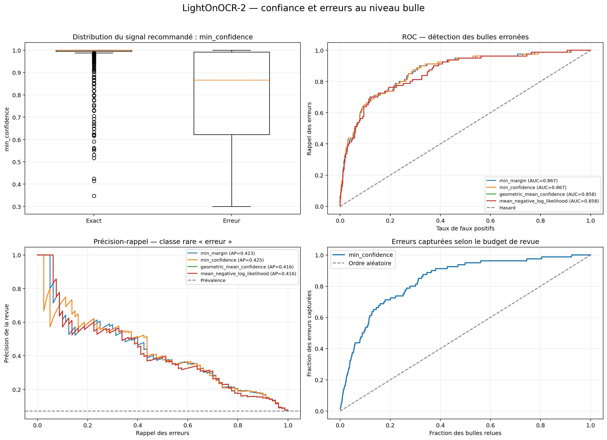
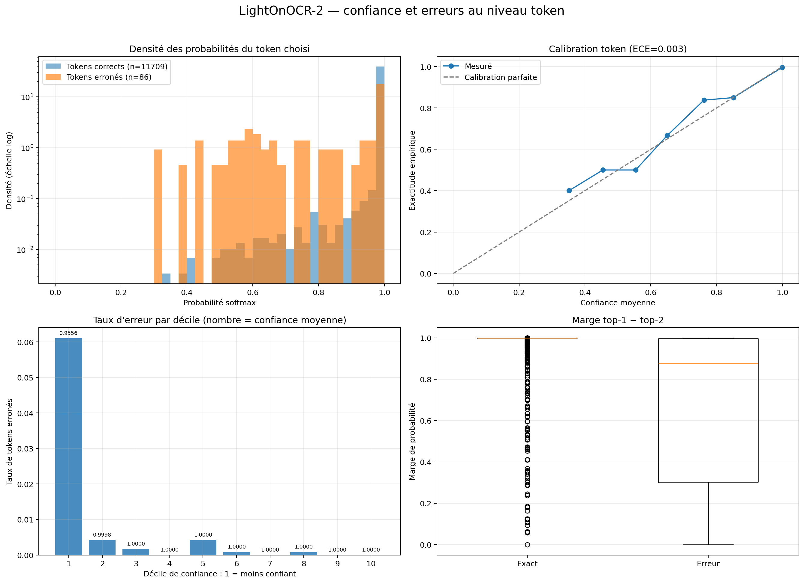

# Analyse finale — confiance OCR LightOnOCR-2 et Surya OCR 2

_Généré le 2026-07-28T17:53:16.325330+00:00 à partir des ground truths Supabase._

## Conclusion

La confiance token est utile pour les deux modèles comme **signal de priorisation de revue**, pas comme probabilité absolue ni comme règle d'auto-validation. Le signal simple à retenir est `min(token_probability)` au niveau bulle et mot.

Les métriques held-out ci-dessous proviennent de splits test différents et ne doivent pas servir seules à déclarer un vainqueur. La comparaison appariée complète sur 1 128 crops est fournie séparément, avec une contamination potentielle pour Surya. Le noyau rigoureusement held-out pour les deux modèles ne contient que 132 bulles.

## Protocole et provenance

Les identifiants proviennent des `benchmark_test.json` publiés sur Hugging Face. Les lignes `bulles` au statut `Validé`, le champ `texte_propose`, les coordonnées et les pages sources ont ensuite été réexportés depuis Supabase. Les crops ont été reconstruits localement sans padding.

| Modèle | Révision immuable | Test | GT modifiées depuis publication |
| --- | --- | --- | --- |
| LightOnOCR-2 | `43075526e81640bf2b18ec8f35a45f7dfb1ddfec` | 1 128 bulles / 129 pages | 3 |
| Surya OCR 2 | `44181694525b026d26dcc8223764c4ec68a1c911` | 1 221 bulles / 129 pages | 2 |

Les deux modèles sont exécutés avec Transformers en BF16 sur RTX 3090, greedy decoding, leur prompt de fine-tune et leur post-traitement respectif. Les probabilités proviennent de `compute_transition_scores(..., normalize_logits=True).exp()` sur les tokens effectivement choisis. L'alignement erreur/token repose sur les opérations Levenshtein ; les insertions dans la référence sont comptées séparément comme omissions.

## Résultats held-out propres à chaque modèle

| Modèle | N | Exact match | CER | Erreurs subst. | AUC bulle | AP bulle | AUC token |
| --- | --- | --- | --- | --- | --- | --- | --- |
| LightOnOCR-2 | 1128 | 92.91 % | 0.397 % | 25 | 0.867 | 0.425 | 0.930 |
| Surya OCR 2 | 1221 | 90.17 % | 1.994 % | 62 | 0.874 | 0.544 | 0.925 |

Surya atteint sa limite de 96 tokens sur **33 bulles held-out**. En priorisant ces cas avant le tri par confiance, l'AUC bulle passe de **0.874** à **0.931**. `max_tokens_reached` doit donc être un motif de revue explicite.

### Discrimination et calibration détaillées

| Modèle | AUC bulle | IC95 page | AP bulle | AUC token | AP token | AUC mot | ECE token |
| --- | --- | --- | --- | --- | --- | --- | --- |
| LightOnOCR-2 | 0.867 | [0.825, 0.905] | 0.425 | 0.930 | 0.295 | 0.906 | 0.0035 |
| Surya OCR 2 | 0.874 | [0.827, 0.909] | 0.544 | 0.925 | 0.267 | 0.808 | 0.0018 |

LightOn contient **11795 tokens**, dont **86** alignés sur une substitution/suppression et **25** rattachements d'omission. Surya contient **39472 tokens**, **125** tokens erronés et **59** omissions rattachées.

La marge top-1/top-2 ne justifie pas son coût fonctionnel : pour Surya, `min_confidence` dépasse `min_margin` en AUC (0.874 contre 0.872) et en AP (0.544 contre 0.516). Pour LightOn, l'écart d'AUC est négligeable et l'AP favorise également la probabilité minimale. Les alternatives top-k peuvent donc rester un mode de debug.

Les ECE globaux sont faibles, mais **11651/11795** tokens LightOn et **39321/39472** tokens Surya sont dans la tranche 0,9–1,0. Cette masse de cas faciles domine la calibration ; les zones basses restent peu peuplées.

## Rendement de revue avec `min(token_probability)`

| Budget | LightOn strict | Surya strict | LightOn subst. | Surya subst. |
| --- | --- | --- | --- | --- |
| 5 % | 37.5 % | 32.5 % | 52.0 % | 41.9 % |
| 10 % | 52.5 % | 52.5 % | 60.0 % | 54.8 % |
| 20 % | 71.2 % | 70.8 % | 84.0 % | 66.1 % |
| 30 % | 80.0 % | 83.3 % | 88.0 % | 82.3 % |
| 50 % | 95.0 % | 94.2 % | 100.0 % | 95.2 % |

Avec la règle déterministe `max_tokens_reached` placée avant la confiance, Surya capture à 20 % de revue **85.0 %** des erreurs strictes, contre **70.8 %** avec la confiance seule.

### Seuils exploratoires

| Rappel cible | Seuil LightOn | Revue LightOn | Seuil Surya | Revue Surya |
| --- | --- | --- | --- | --- |
| 80 % | ≤ 0.994703 | 27.9 % | ≤ 0.996702 | 28.8 % |
| 90 % | ≤ 0.997806 | 36.4 % | ≤ 0.998794 | 40.4 % |
| 95 % | ≤ 0.999438 | 49.9 % | ≤ 0.999409 | 51.1 % |

Ces seuils sont ajustés sur les jeux analysés et ne doivent pas être copiés tels quels en production. Leur proximité de 1,0 illustre aussi pourquoi une configuration unique et intuitive du type 0,8 serait inefficace.

## Coût de collecte des scores

| Modèle | Débit normal | Débit scores | Temps | VRAM normale | VRAM scores |
| --- | --- | --- | --- | --- | --- |
| LightOnOCR-2 | 21.36 | 20.71 | +3.10 % | 2.14 Gio | 3.57 Gio |
| Surya OCR 2 | 5.69 | 5.48 | +3.69 % | 1.45 Gio | 2.12 Gio |

Le coût temporel reste faible, mais `output_scores=True` conserve les logits de tous les pas et augmente sensiblement le pic mémoire. En production, conserver uniquement les log-probabilités choisies et ne calculer les alternatives que sur demande.

Les profils utilisent 128 crops, trois répétitions et un ordre alterné. Les séquences restent identiques avec/sans scores : **128/128** pour LightOn et **128/128** pour Surya.

## Comparaison appariée sur les 1 128 crops LightOn

**Attention :** 996 de ces exemples ne sont pas dans le test Surya ; ils peuvent avoir été vus pendant son entraînement.

| Modèle | N | Exact match | CER | Erreurs subst. |
| --- | --- | --- | --- | --- |
| LightOnOCR-2 | 1128 | 92.91 % | 0.397 % | 25 |
| Surya OCR 2 | 1128 | 94.33 % | 1.070 % | 29 |

| Mesure | Valeur |
| --- | --- |
| Désaccord entre modèles | 10.20 % |
| LightOn seul correct | 43 |
| Surya seul correct | 59 |
| Tous deux corrects | 1005 |
| Tous deux faux | 21 |
| Précision quand ils sont strictement d'accord | 99.21 % |
| Erreurs LightOn signalées par désaccord | 90.0 % |
| Erreurs Surya signalées par désaccord | 87.5 % |
| Accords faux, invisibles au désaccord | 8 |

## Intersection held-out pour les deux modèles (132 bulles)

| Mesure | Valeur |
| --- | --- |
| Désaccord | 5.30 % |
| LightOn seul correct | 7 |
| Surya seul correct | 0 |
| Tous deux corrects | 125 |
| Tous deux faux | 0 |
| Précision des accords | 100.00 % |
| Accords faux | 0 |

L'intersection est utile pour observer la complémentarité, mais trop petite pour régler des seuils définitifs.

## Faux négatifs : erreurs substantielles très confiantes

Même avec une bonne AUC, les deux modèles produisent des erreurs dont tous les tokens choisis sont très probables. Elles interdisent une auto-validation fondée uniquement sur la confiance.

### LightOnOCR-2

| ID | Min confidence | CER | Référence | Prédiction |
| --- | --- | --- | --- | --- |
| 5733 | 0.998042 | 0.043 | Ne t'en fais pas, ce n'est pas ce qui le tuera. | Ne t'en fais pas, ce n'est pas ça qui le tuera. |
| 4312 | 0.996971 | 0.040 | Tu n'as jamais demandé à quelqu'un de passer de te donner un coup de main ? | Tu n'as jamais demandé à quelqu'un de passage de te donner un coup de main ? |
| 4821 | 0.996339 | 0.276 | Ma foi, c'est comme une façon autre d'embellir la réalité. | Ma foi, c'est une façon comme une autre d'embellir la réalité. |
| 3150 | 0.992444 | 0.250 | Eurk | Eury |
| 7555 | 0.972092 | 0.067 | Lui... Luffy ?! | Lu... Luffy ?! |
| 5727 | 0.946297 | 0.100 | Aaahhhh !! | Aahhhh !! |

### Surya OCR 2

| ID | Min confidence | CER | Référence | Prédiction |
| --- | --- | --- | --- | --- |
| 3978 | 0.997781 | 0.017 | Qui voilà ! On commençait à s'impatientier, sale voleuse !! | Qui voilà ! On commençait à s'impatienter, sale voleuse !! |
| 6484 | 0.996979 | 0.020 | Ne vous genez pas pour aller leur porter secours. | Ne vous gênez pas pour aller leur porter secours. |
| 1324 | 0.996915 | 0.057 | Ahhh, lâche-moi ! Papa, à l'aide !! | Ahhh, lâche-moi ! Papa, à l'aiiide !! |
| 4075 | 0.995884 | 0.073 | Franchette, vous faites une belle brochette de rigolos. | Franchement, vous faites une belle brochette de rigolos. |
| 1277 | 0.989005 | 0.077 | Non colonel ! | Non colonnel ! |
| 2129 | 0.962316 | 0.027 | Évidement !! Pour qui tu me prends ?! | Évidemment !! Pour qui tu me prends ?! |

## Troncatures Surya à 96 tokens

Sur le held-out Surya, les 33 générations qui atteignent la limite sont toutes erronées. Une confiance locale élevée ne peut pas détecter le texte manquant après le dernier token généré.

| ID | Min confidence | CER | Référence | Prédiction tronquée |
| --- | --- | --- | --- | --- |
| 4086 | 0.999495 | 0.432 | Ce serait encore mieux si on y trouvait de quoi faire des provisions. Nami n'a pas entièrement tort lorsq | Ce serait encore mieux si on y trouvait de quoi faire des provisions. Nami n'a pas entièrement t |
| 284 | 0.997429 | 0.387 | Celui qui le mange voit son corps devenir élastique, comme du caoutchouc ! Mais en contrepartie il devien | Celui qui le mange voit son corps devenir élastique, comme du caoutchouc ! Mais en contrepartie |
| 3642 | 0.879467 | 0.321 | Évidemment que je suis ravi ! Les navires ennemis sont toujours remplis de trésors, et c'est en s'en empa | Évidemment que je suis ravi ! Les navires ennemis sont toujours remplis de trésors, et c'est en |
| 6629 | 0.996792 | 0.296 | N'oubliez pas que nous sommes ici sur ordre du capitaine Kuro ! Dois-je vous rappeler quel sort il réserv | N'oubliez pas que nous sommes ici sur ordre du capitaine Kuro ! Dois-je vous rappeler quel sort |
| 4383 | 0.496380 | 0.280 | Eh bien figurez-vous que la plupart des visiteurs de l'île viennent pour chasser ces animaux fantastiques | Eh bien figurez-vous que la plupart des visiteurs de l'ile viennent pour chasser ces animaux fan |
| 711 | 0.999874 | 0.238 | Deux ans ont passé depuis, ils me laissent en vie uniquement en échange de mes services de navigateur et  | Deux ans ont passé depuis, ils me laissent en vie uniquement en échange de mes services de navig |
| 4552 | 0.998794 | 0.234 | Et s'est retrouvée à la tête d'un immense héritage, de ce manoir, ainsi que de toute une flopée de majord | Et s'est retrouvée à la tête d'un immense héritage, de ce manoir, ainsi que de toute une flopée |
| 1900 | 0.499701 | 0.232 | Si on s'était doutés que vous étiez Zoro le chasseur de pirates, on ne vous aurait jamais adressé la paro | Si on s'était doutés que vous étiez Zoro le chasseur de pirates, on ne vous aurait jamais adress |

## Architecture recommandée

1. Conserver `log_probability` du token choisi, sans top-k par défaut.
2. Agréger par mot : minimum pour l'alerte locale, moyenne géométrique pour l'affichage avancé.
3. Calibrer séparément LightOn et Surya ; aucune valeur brute universelle.
4. Déclencher la revue par budget/percentile plutôt que par seuil figé.
5. Ajouter `model_disagreement` comme raison de revue indépendante.
6. Ajouter `max_tokens_reached` pour Surya avant toute décision de confiance.
7. Ne jamais auto-valider uniquement sur confiance : omissions et erreurs très confiantes subsistent.
8. Journaliser confirmations et corrections pour recalibrer hors échantillon.

### Format minimal conseillé

```json
{
  "engine": "surya|lighton",
  "text": "...",
  "raw_min_token_probability": 0.97,
  "calibrated_review_score": 0.42,
  "review_required": true,
  "review_reasons": ["low_local_confidence", "model_disagreement"],
  "segments": [
    {"text": "mot", "start": 0, "end": 3, "confidence": 0.97}
  ]
}
```

Pour Surya, ajouter `max_tokens_reached` à `review_reasons`. Les scores bruts restent utiles au débogage, mais l'interface doit consommer un score calibré par moteur et des raisons explicites.

## Figures

### LightOn — niveau bulle



### LightOn — niveau token



### Surya held-out — niveau bulle


### Surya held-out — niveau token


## Artefacts

- LightOn : `docker_scripts/finetune_lighton_ocr/confidence_benchmark/results/`
- Surya held-out : `docker_scripts/finetune_surya_bubble_ocr/confidence_benchmark/results/heldout/`
- Surya apparié : `docker_scripts/finetune_surya_bubble_ocr/confidence_benchmark/results/paired_lighton/`
- Prédictions brutes : fichiers `predictions.jsonl` locaux dans chaque benchmark.
- Métriques JSON : fichiers `metrics.json` dans chaque dossier de résultats.
- Profil A/B : `performance_profile.json` dans chaque benchmark.

## Limites

- Les erreurs de casse/ponctuation et les erreurs alphanumériques sont rapportées séparément.
- Une omission n'a pas de token émis auquel rattacher une confiance.
- L'ECE global est dominé par la masse de tokens proches de 1,0.
- Les seuils exploratoires sont ajustés sur les jeux analysés.
- Le désaccord ne détecte pas les hallucinations identiques des deux modèles.
