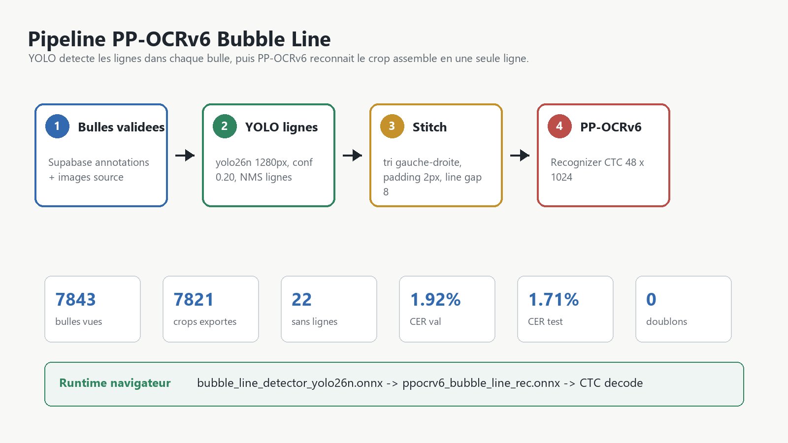
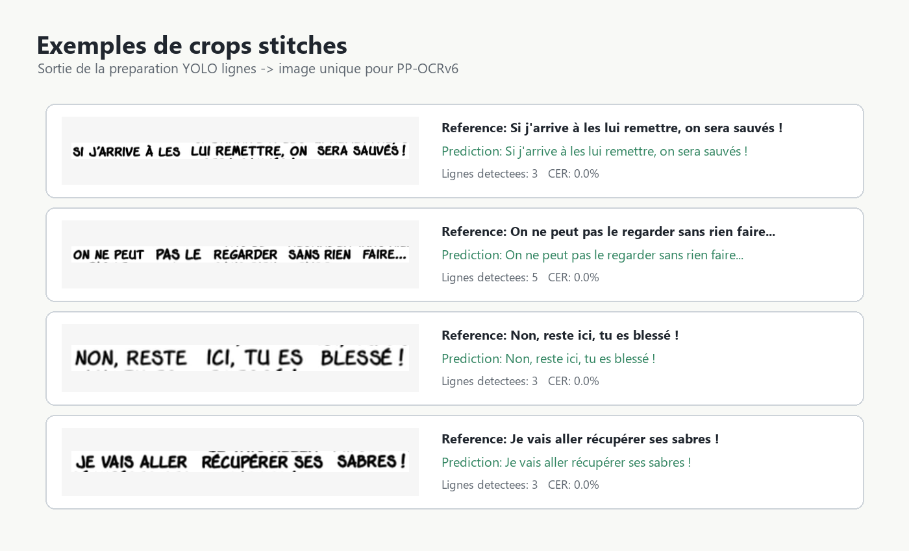
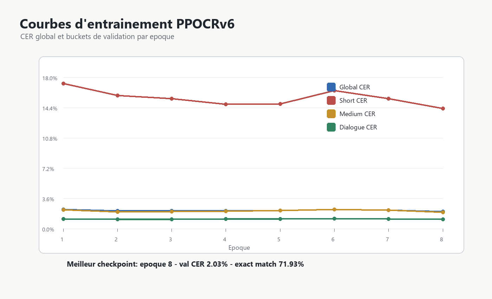
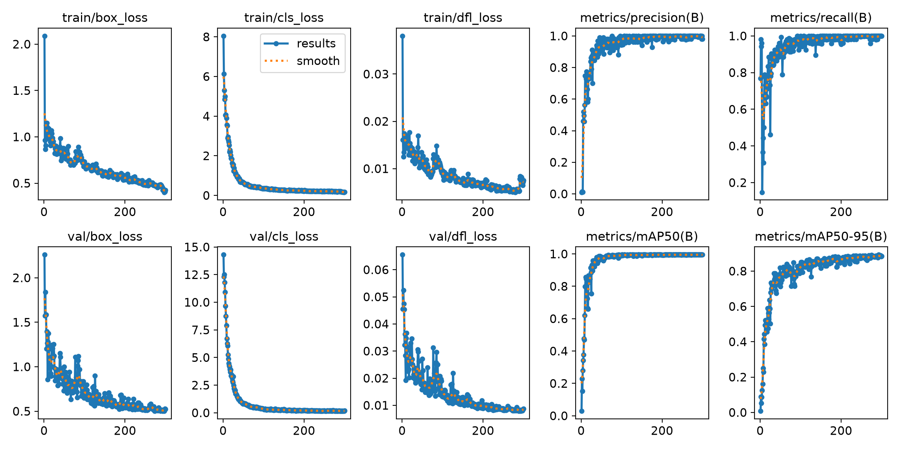

# PP-OCRv6 Bubble Line Recognition

Ce document décrit le modèle OCR local navigateur `ppocrv6Line`, publié sur Hugging Face dans [`Remidesbois/pp-ocrv6-one-piece-bubble-line-rec`](https://huggingface.co/Remidesbois/pp-ocrv6-one-piece-bubble-line-rec).

Le modèle est composé de deux graphes ONNX :

- `bubble_line_detector_yolo26n.onnx` : détecte les lignes de texte à l'intérieur d'une bulle.
- `ppocrv6_bubble_line_rec.onnx` : reconnait le texte sur l'image de bulle reconstruite en une seule ligne.

## Résultat Du Run 2026-06-29

| Mesure | Ancien modèle | Nouveau modèle |
|---|---:|---:|
| CER validation publié | 3.7388% | 1.9204% |
| Exact-match validation | 66.64% | 71.62% |
| CER test | non publié | 1.7097% |
| Exact-match test | non publié | 71.21% |
| Bulles exportées | 7797 / 7843 | 7821 / 7843 |
| Bulles sans ligne détectée | 46 | 22 |
| Doublons de lignes détectés | 0 | 0 |

Le gain principal vient de la combinaison suivante :

- nouveau détecteur de lignes YOLO26n entrainé en `1280px` ;
- seuil de détection plus permissif (`conf=0.20`) ;
- déduplication des lignes par NMS dédiée (`line_nms_iou=0.75`) ;
- fine-tune PP-OCRv6 repris depuis la release précédente, avec backbone dégelé ;
- sur-échantillonnage et pondération plus forts pour les textes courts (`2.5`).

## Pipeline De Données

1. Les bulles validées sont récupérées depuis Supabase avec leur texte cible.
2. Chaque image source est traitée par le YOLO de lignes.
3. Les boites de lignes trop proches sont dédupliquées.
4. Les lignes sont triées gauche-droite puis assemblées en une image horizontale.
5. Cette image devient l'exemple d'entrainement PP-OCRv6.

Exemples de crops reconstruits :

Statistiques du dataset reconstruit :

| Split | Images |
|---|---:|
| Train | 5411 |
| Validation | 1191 |
| Test | 1219 |

Paramètres de conversion :

| Paramètre | Valeur |
|---|---:|
| YOLO image size | 1280 |
| YOLO confidence | 0.20 |
| YOLO IoU | 0.45 |
| Line NMS IoU | 0.75 |
| Padding ligne | 2 px |
| Gap entre lignes | 8 px |

## Entrainement

Le run PPOCRv6 final a été lancé depuis `docker_scripts/finetune_paddleocr_line_rec`, avec le nouveau détecteur monté en `/workspace/line_detector`.

Configuration retenue :

| Réglage | Valeur |
|---|---:|
| Base model | `PaddlePaddle/PP-OCRv6_medium_rec_safetensors` |
| Resume | release HF précédente |
| Epochs | 8 |
| Batch size | 2 |
| Gradient accumulation | 8 |
| Effective batch size | 16 |
| Image size | 48 x 1024 |
| Learning rate | 8e-6 |
| Backbone learning rate | 8e-7 |
| Scheduler | cosine |
| Warmup ratio | 0.05 |
| Backbone training | activé |
| AMP | activé |
| Short text max len | 12 |
| Short oversample | 2.5 |
| Short loss weight | 2.5 |

Courbes de validation :

Le meilleur checkpoint est l'époque 8 :

| Métrique validation | Valeur |
|---|---:|
| CER global | 2.0302% |
| Exact-match | 71.93% |
| CER textes courts | 14.3083% |
| CER textes moyens | 1.9506% |
| CER dialogue | 1.1129% |

## Détecteur De Lignes

Métriques principales :

| Backend | mAP50 | mAP50-95 |
|---|---:|---:|
| PyTorch | 99.50% | 89.27% |
| ONNX | 99.50% | 88.99% |

## Analyse Des Erreurs

Le modèle est maintenant très fort sur les bulles longues et les dialogues. Les erreurs restantes sont concentrées sur les bruitages et segments très courts : cris, ponctuation seule, onomatopées, et variations de casse.

## Export ONNX

Validation export :

| Test | Résultat |
|---|---:|
| Samples de parité PyTorch / ONNX | 12 |
| Texte identique | oui |
| Max absolute diff | 6.03199e-05 |
| Taille recognizer ONNX | 73.02 Mo |
| Taille YOLO ONNX | 9.83 Mo |
